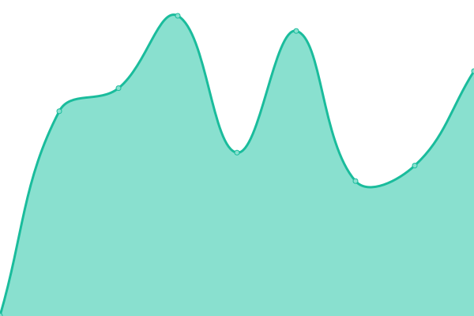

# [📈 Live Status](https://status.pterodactyl-installer.se): <!--live status--> **🟩 All systems operational**

This repository contains the open-source uptime monitor and status page for [Pterodactyl Installer](https://pterodactyl-installer.se), powered by [Upptime](https://github.com/upptime/upptime).

With [Upptime](https://upptime.js.org), you can get your own unlimited and free uptime monitor and status page, powered entirely by a GitHub repository. We use [Issues](https://github.com/pterodactyl-installer/service-status/issues) as incident reports, [Actions](https://github.com/pterodactyl-installer/service-status/actions) as uptime monitors, and [Pages](https://status.pterodactyl-installer.se) for the status page.

<!--start: status pages-->
<!-- This summary is generated by Upptime (https://github.com/upptime/upptime) -->
<!-- Do not edit this manually, your changes will be overwritten -->
<!-- prettier-ignore -->
| URL | Status | History | Response Time | Uptime |
| --- | ------ | ------- | ------------- | ------ |
|  [pterodactyl-installer.se](https://pterodactyl-installer.se) | 🟩 Up | [pterodactyl-installer-se.yml](https://github.com/pterodactyl-installer/service-status/commits/HEAD/history/pterodactyl-installer-se.yml) | 

 453ms
     
 | 

<a href="https://status.pterodactyl-installer.se/history/pterodactyl-installer-se">100.00%</a>
    

|  [checkip.pterodactyl-installer.se](https://checkip.pterodactyl-installer.se) | 🟩 Up | [checkip-pterodactyl-installer-se.yml](https://github.com/pterodactyl-installer/service-status/commits/HEAD/history/checkip-pterodactyl-installer-se.yml) | 

 540ms
     
 | 

<a href="https://status.pterodactyl-installer.se/history/checkip-pterodactyl-installer-se">100.00%</a>
    

<!--end: status pages-->

[**Visit our status website →**](https://status.pterodactyl-installer.se)

## 📄 License

- Powered by: [Upptime](https://github.com/upptime/upptime)
- Code: [MIT](./LICENSE) © [Pterodactyl Installer](https://pterodactyl-installer.se)
- Data in the `./history` directory: [Open Database License](https://opendatacommons.org/licenses/odbl/1-0/)
